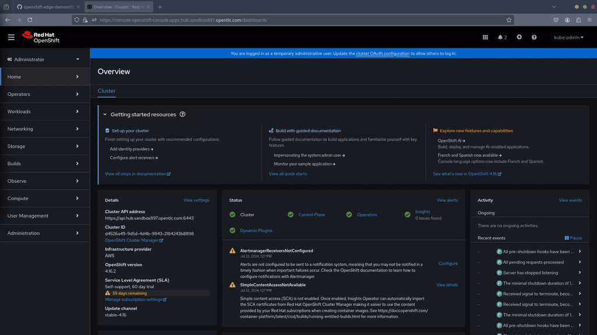

# Bootstrap environment

All demo deployment will involve two main task groups:

1. **Base environment deployment**
2. **Demo-specific setup**

While the demo-specific setup is explained separately in dedicated documentation as part of each demo, the base environment deployment, which is common to all demos and always is required, will be explained here.

The base environment consist in two components deployed on top of OpenShift:
* Red Hat Advance Cluster Management (ACM)
* Red Hat GitOps operator (ArgoCD)

## 1. Base environment deployment steps

a) **Clone this repository and adjust values**
b) **OpenShift "Hub" Cluster base configuration**

### a) Fork this Repository and Adjust Values

To change values during the demo, fork this repository.

1. Fork `https://github.com/luisarizmendi/openshift-edge-demos` into your GitHub account.
2. Clone it locally on your desktop.
3. Run the `change_repo_url.sh` script to update all repository references to your fork:

   ```bash
   cd tools
   ./change_repo_url.sh https://github.com/<your-github-username>/<fork-name>
   ```
  > **NOTE**
  >
  > Do not include the tailing `.git` or any slash at the end.

3. Push changes to your fork repo

   ```bash
   cd ..
   git add .
   git commit -m "Change repo references"
   git push
   ```

### b) OpenShift "Hub" Cluster Base Configuration

Complete the following steps before deploying your demo:

1. **Prepare Your OpenShift Clusters**: Ensure that the required OpenShift clusters are freshly installed. This demo has been tested with OpenShift 4.16.

2. **Apply the Base Configuration to the Hub Cluster**:
   - Access your OpenShift console in the Hub cluster.
   - Click the `+` button to add resources.
   - Paste the content from the [bootstrap-environment.yaml](../bootstrap-environment.yaml) file.

   

   > **Note**
   >
   > If you try to access ACM immediately after seeing the web plugin update message, you might encounter a warning stating "Red Hat Advanced Management for Kubernetes is not ready." Please wait a bit longer for ACM to fully initialize.

3. **Wait Until the Advanced Cluster Manager Console is Accessible**

   


### 2. Demo-Specific Setup

Now it is time to jump into the preparation steps for your specific demo...