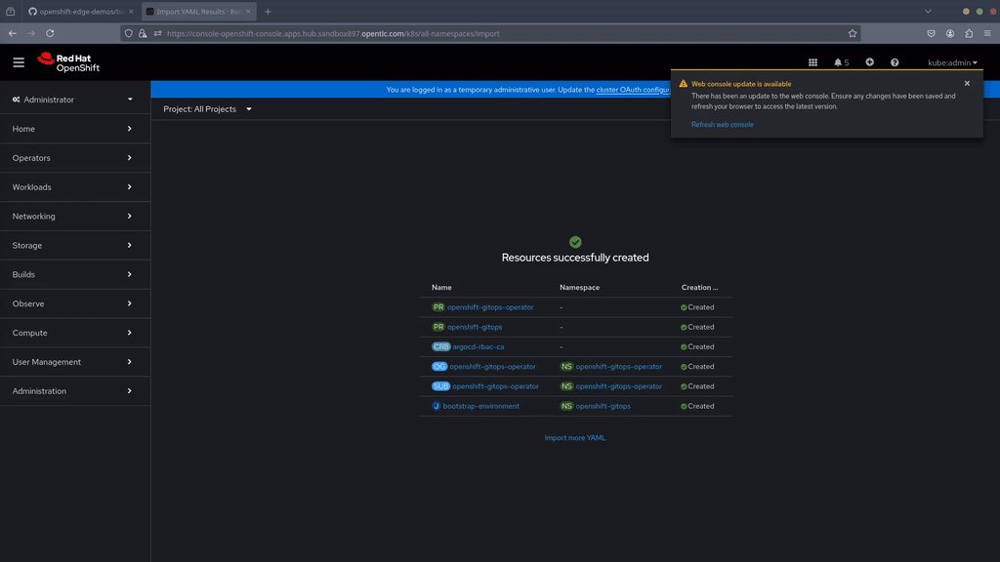

# Workload Placement - Demo Preparation

## Environment & Hardware requirements 

* **OpenShift "Hub" Cluster**: Typically configured with 3 worker nodes, each possessing 8 cores and 16GB of memory.
* **OpenShift "Edge" Clusters**: At least one additional OpenShift cluster (Minimum resources is ok). 

  > **NOTE**
  >
  > The "Hub" Cluster is the OpenShift Cluster where ACM is deployed. In this case this will be our "Cloud" cluster.


## Environment Setup

All demo deployments comprehends three main groups of steps:

0. **Clone this repository and ajust values**

1. **OpenShift "Hub" Cluster base configuration**

2. **Demo specific setup**


### 0. Fork this repository and adjust values
You will need to change values in GitHub during the demo, so you will need to fork it.

1. Fork `https://github.com/luisarizmendi/openshift-edge-demos` into your GitHub account
2. Clone it locally in your desktop
3. Run the `change_repo_url.sh` that will change all references in the repo to use your fork

   ```bash
   cd scripts
   ./change_repo_url.sh https://github.com/<your github user>/<fork name>
   ```
  > **NOTE**
  >
  > Do not include the tailing `.git` or any slash at the end.

3. Push changes to your fork repo

   ```bash
   cd ..
   git add .
   git commit -m "Change repo references"
   git push
   ```

### 1. OpenShift "Hub" Cluster base configuration

You need to complete these steps before deploying your demo:

1. **Prepare your OpenShift Clusters**: Ensure you have freshly installed the required OpenShift clusters. The demo has been tested with OpenShift 4.16.

2. **Apply the Base Configuration in the Hub Cluster**:
   - Access your OpenShift console in the Hub cluster.
   - Click the `+` button to add resources.
   - Paste the content from the [bootstrap-environment.yaml](../../bootstrap-environment/bootstrap-environment.yaml) file.


  > **NOTE**
  >
  > It's possible that if you try to access ACM as soon as the web plugin update message appears, you will get another warning message that says "Red Hat Advanced MAangement for Kubernetes is not ready".Just wait a little bit more time so the ACM is completely up.

3. **Wait until you can open the Advanced Cluster Manager console**




### 2. Demo specific setup

Now you can deploy the components needed by your demo and apply the required configuration.

4. **Apply the demo specific setup**
   - Access your OpenShift console in the Hub cluster.
   - Click the `+` button to add resources.
   - Paste the content from the [bootstrap-demo.yaml](bootstrap-demo/bootstrap-demo.yaml) file.


5. **Wait until you can see all applications in "Sync"status in the Argocd console** 


Once the setup is complete, you can proceed with the demo steps.
